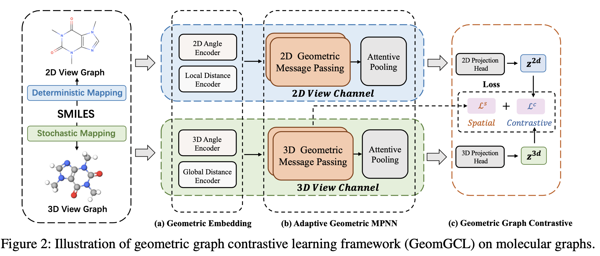

## GeomGCL-Paddle
Source code for AAAI 2022 paper: "GeomGCL: Geometric Graph Contrastive Learning for Molecular Property Prediction".
<p align="center">
  
  <br />
</p> 

### Dependencies
- python >= 3.7
- paddlepaddle >= 2.3.0
- pgl >= 2.2.3
- rdkit == 2020.03.3.0 (optional, only for preprocessing)

### Datasets
The molecule dataset can be downloaded [here](https://moleculenet.org/datasets-1).

### Preprocessing
The downloaded dataset (csv-format files) should be converted to obtain 3D molecules with 3D coordinates (sdf-format):
```
python convert_to_sdf.py --dataset DATASET_NAME --algo MMFF/ETKDG/UFF
```
Then we can generate the features for 2D view and 3D view molecules:
```
python preprocess.py --dataset DATASET_NAME --data_dir YOUR_DATASET_DICTIONARY
```

### How to run
To pre-train the model based on geometric contrastive learning, you can run this command:
```
python train_gcl.py --cuda YOUR_DEVICE --dataset DATASET_NAME --num_dist 4 --cut_dist 5 --model_dir MODEL_PATH_TO_SAVE
```
To finetune the model:
```
python train_finetune.py --cuda YOUR_DEVICE --dataset DATASET_NAME --model_dir MODEL_PATH_TO_LOAD --task_dim TASK_NUMBER --num_dist 2 --num_angle 4 --cut_dist 4 --output_dir OUTPATH_PATH_TO_SAVE
```

### Citation
If you find our work is helpful in your research, please consider citing our paper:
```bibtex
@inproceedings{li2022geomgcl,
  title={GeomGCL: Geometric Graph Contrastive Learning for Molecular Property Prediction},
  author={Li, Shuangli and Zhou, Jingbo and Xu, Tong and Dou, Dejing and Xiong, Hui},
  booktitle={Proceedings of the Thirty-Six AAAI Conference on Artificial Intelligence},
  pages={4541-4549},
  year={2022}
}
```
If you have any question, please feel free to contact with me by email: lsl1997@mail.ustc.edu.cn.